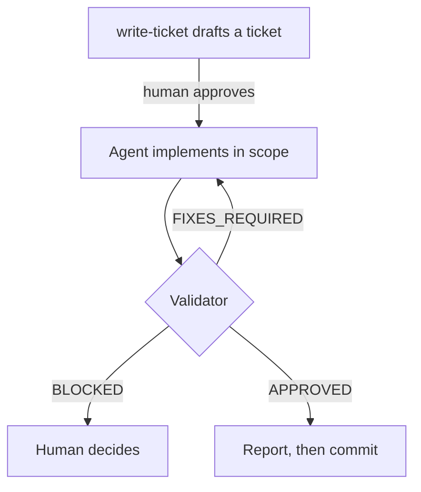

# AEGIS

**Scoped, independently validated, traceable changes from AI coding agents.**

AI coding agents drift. They widen scope, refactor code nobody asked them to
touch, approve their own work, and report checks that never ran. AEGIS is a
short rule set plus enforcement tooling. Every agent change stays inside a
ticket the human approved, is reviewed by an agent that didn't write it, and
lands as one traceable commit.

It's for developers who use Claude Code, Codex, or similar agents on real
codebases and want to control what changes without reading every line of
every diff. It is not a spec-to-code pipeline or an autonomous multi-agent
system: it puts reviewability ahead of volume.

## How it works



1. **Ticket.** Every edit starts from a ticket the human approved. It names the
   goal, the paths the agent may change, protected paths, checkable acceptance
   criteria, and the commands that verify them.
2. **Implement.** The agent changes only what the ticket allows. A behavior
   change starts with a check that fails before the change.
3. **Validate.** A separate validator with a fresh context runs the checks
   itself, reads the whole diff, and blocks until the ticket is met.
4. **Report and commit.** The agent reports what changed, what was verified,
   and what wasn't. Each ticket is one commit, and git hooks reject anything
   outside its scope.

## Architecture

| Layer | File | What it does |
| --- | --- | --- |
| Rules | [`AGENTS.md`](AGENTS.md) | Always loaded. The loop, the ticket format, and the rules. |
| Planning | [`write-ticket`](.claude/skills/write-ticket/SKILL.md) skill | Loaded on demand. Turns a request into a ticket and asks instead of guessing intent. |
| Review | [`validator`](.claude/agents/validator.md) subagent | Runs in a fresh context and never edits. Independent because it didn't write the code. |
| Enforcement | [`hooks/`](hooks/), [`tools/check_scope.py`](tools/check_scope.py) | Deterministic. Rejects commits outside the active ticket's scope or without its ID. |

Instructions guide the agent; code enforces what matters most. Anything a hook
can check isn't left to instructions alone.

## Core rules

- No edits without an approved ticket, and one ticket at a time.
- Change only `allowed_areas` and never `must_not_touch`. If the work doesn't
  fit, stop and ask; never widen scope.
- When intent is unclear, ask instead of filling the gap with a plausible
  default.
- Make the smallest diff that meets the acceptance criteria: no speculative
  code, no unrelated refactors.
- The validator is blocking. Only the human can override it, and an override
  is reported as one.
- Never claim a check passed without running it, and name every skipped check.
- One commit per ticket, `[ID] description`, containing the ticket file and
  its work.

The full rules are in [`AGENTS.md`](AGENTS.md).

## A ticket

```yaml
id: SHOP-012
goal: Invoices show VAT per line.
context: Accountants reconcile VAT per invoice line.
depends_on: []
allowed_areas: [.aegis/tickets/SHOP-012.yaml, src/billing/, tests/billing/]
must_not_touch: [src/billing/migrations/]
non_goals: [Changing the PDF layout.]
acceptance_criteria: [Each invoice line returns its VAT amount.]
verify: [pytest tests/billing]
manual_checks: []
```

A path ending in `/` covers a directory; any other path must match exactly.
There are no globs, and `must_not_touch` wins over `allowed_areas`. Tickets
live in `.aegis/tickets/<ID>.yaml`, and the active ticket's ID is in
`.aegis/active-ticket`.

## Setup

Requires git, Python 3 with PyYAML, and a POSIX shell for the hooks (Git Bash
on Windows).

1. **Rules.** Copy `AGENTS.md` to your project root. Claude Code and Codex
   read it directly. If the project has a `CLAUDE.md`, add `@AGENTS.md` to
   it. To cover every project, put the rules in `~/.claude/CLAUDE.md` or
   `~/.codex/AGENTS.md` instead.
2. **Skill and validator.** Copy `.claude/skills/write-ticket/` and
   `.claude/agents/validator.md` into the project's `.claude/` directory, or
   into `~/.claude/` for every project.
3. **Git.** Add `.aegis/active-ticket` to `.gitignore` and commit that change.
4. **Hooks.** Copy `hooks/pre-commit` and `hooks/commit-msg` into
   `.git/hooks/` and make them executable. Set `AEGIS_CORE_ROOT` to this
   repository (default `../aegis-core`) and `AEGIS_PYTHON` to a Python with
   PyYAML (default `python3`; on Windows, for example, `py -3.10`).

Once the hooks are installed, every commit needs an active ticket.

## Daily use

1. Describe the change. The agent drafts a ticket with `write-ticket`; in
   Claude Code you can also run `/write-ticket` yourself.
2. Approve or correct the ticket.
3. The agent implements and runs the validator until it approves.
4. Read the completion report and do any manual checks it lists.
5. Ask the agent to commit.

To check scope by hand, run this from the project root:

```bash
python3 "$AEGIS_CORE_ROOT/tools/check_scope.py" --ticket .aegis/tickets/SHOP-012.yaml --staged
```

Exit 0 means every file is in scope, 1 lists the violations, and 2 means the
check itself failed.
